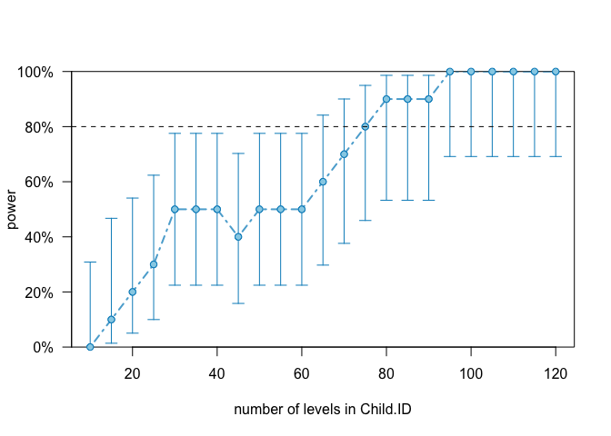

# Power Analysis using simr
-------------------------

## Install packages from Git
Prior to this make sure your **R version is 3.5.3** or above. Furhermore
simr might **require dependencies**. Make sure these are met.

``` r
#library(githubinstall)
#githubinstall("simr", lib = .libPaths())
print(pacman::p_path() == .libPaths()) # should be the same!!
```

    ## [1] TRUE

``` r
pacman::p_load(tidyverse, lmerTest, simr)
```

Read the data
-------------
You shouldn’t need this, but I have put it here to make sure you can
replicate my results.
``` r
CleanUpData <- function(Demo,LU,Word){
  
  Speech <- merge(LU, Word) %>% 
    rename(
      Child.ID = SUBJ, 
      Visit = VISIT) %>%
    mutate(
      Visit = as.numeric(str_extract(Visit, "\\d")),
      Child.ID = gsub("\\.","", Child.ID)
      ) %>%
    dplyr::select(
      Child.ID, Visit, MOT_MLU, CHI_MLU, types_MOT, types_CHI, tokens_MOT, tokens_CHI
    )
  
  Demo <- Demo %>%
    dplyr::select(
      Child.ID, Visit, Ethnicity, Diagnosis, Gender, Age, ADOS, MullenRaw, ExpressiveLangRaw, Socialization
    ) %>%
    mutate(
      Child.ID = gsub("\\.","", Child.ID)
    )
    
  Data = merge(Demo, Speech, all = T)
  
  Data1 = Data %>% 
    subset(Visit == "1") %>% 
     dplyr::select(Child.ID, ADOS, ExpressiveLangRaw, MullenRaw, Socialization) %>%
     rename(Ados1 = ADOS, 
            verbalIQ1 = ExpressiveLangRaw, 
            nonVerbalIQ1 = MullenRaw,
            Socialization1 = Socialization) 
  
  Data = merge(Data, Data1, all = T) %>%
    mutate(
      Child.ID = as.numeric(as.factor(as.character(Child.ID))),
      Visit = as.numeric(as.character(Visit)),
      Gender = recode(Gender, 
         "1" = "M",
         "2" = "F"),
      Diagnosis = recode(Diagnosis,
         "A"  = "ASD", # Note that this function is fixed here
         "B"  = "TD")
    )

  return(Data)
}

# Training Data
#setwd('~/Dropbox/2019 - methods 3/Assignments19/Assignment2/solutions/')
Demo <- read_csv('../../Assignment1/data/demo_train.csv')
LU <- read_csv('../../Assignment1/data/LU_train.csv')
Word <- read_csv('../../Assignment1/data/token_train.csv')
TrainData <- CleanUpData(Demo,LU,Word)
Demo <- read_csv('../../Assignment2/data/demo_test.csv')
LU <- read_csv('../../Assignment2/data/LU_test.csv')
Word <- read_csv('../../Assignment2/data/token_test.csv')
TestData <- CleanUpData(Demo,LU,Word)

# merge training and testing
Data <- merge(TrainData, TestData, all = T)

Data <- Data[complete.cases(Data[,c("CHI_MLU","Visit","Diagnosis","verbalIQ1","Child.ID")]),]
Data$Child.ID <- as.factor(Data$Child.ID)
```

------------------------------------------------------------------------

Create a model
--------------

``` r
InteractionM <- lmer(CHI_MLU ~ Visit * Diagnosis + (1+Visit|Child.ID),
              Data, REML = F,
              control = lmerControl(optimizer = "nloptwrap", calc.derivs = FALSE)) #optimizer should be relevant
```

this model encodes the following hypotheses and assumptions:

1.  We expect child MLU to vary dependent on visit and diagnosis

2.  We expect the effect of visit to vary according to diagnosis
    (interaction)

3.  We have multiple datapoint pr. child ID

4.  We expect each child start from different point (random intercept)
    and increase MLU at different rates (random slope)

## What is the power of Diagnosis?

``` r
sim = powerSim(InteractionM , fixed("Diagnosis"), nsim = 50, seed = 1, progress = F) 
```

    ## Warning in observedPowerWarning(sim): This appears to be an "observed
    ## power" calculation

``` r
sim
```

    ## Power for predictor 'Diagnosis', (95% confidence interval):
    ##       100.0% (92.89, 100.0)
    ## 
    ## Test: unknown test
    ## 
    ## Based on 50 simulations, (50 warnings, 0 errors)
    ## alpha = 0.05, nrow = 387
    ## 
    ## Time elapsed: 0 h 0 m 3 s
    ## 
    ## nb: result might be an observed power calculation

``` r
# progress just turns off the progressbar - makes for a nicer reading experience
# seed = 1 ensures I get the same result also when knitting
```

Oh 100% not too shabby. Note that it gives a warning, which is the same
as for visit. Let’s just ignore it for now. Furthermore it also gives a
warning telling us it is an observed power calculation, this simply
tells us that the visit is fixed effect is the one the model calculated.
We can change this using:

`fixef(InteractionM)["Diagnosis"] <- 0.4`

This is the *minimal interesting effect*, e.g. if the effect is lower
than this we are not interested in it and consequently we should not
make a power analysis for any power lower than this. This is *naturally*
context dependent and you should argue for your minimal interesting
effect. You could for example argue that the mean of the ASD should vary
from the mean of TD by 1 SD (you would need to calculate this) or you
could (and probably should) examine the literature to examine what a
relevant effect might be.

------------------------------------------------------------------------

## What about Visit?

``` r
sim = powerSim(InteractionM , fixed("Visit"), nsim = 50, seed = 1, progress = F)
```

    ## Warning in observedPowerWarning(sim): This appears to be an "observed
    ## power" calculation

``` r
sim
```

    ## Power for predictor 'Visit', (95% confidence interval):
    ##        0.00% ( 0.00,  7.11)
    ## 
    ## Test: unknown test
    ##       Effect size for Visit is 0.13
    ## 
    ## Based on 50 simulations, (50 warnings, 50 errors)
    ## alpha = 0.05, nrow = 387
    ## 
    ## Time elapsed: 0 h 0 m 4 s
    ## 
    ## nb: result might be an observed power calculation

**50 errors**, that is a problem (if there is any errors don’t worry about
the power). Lets examine:

``` r
print(sim$errors$message[1])
```

    ## [1] "Models have either equal fixed mean stucture or are not nested"

``` r
print(sim$warnings$message[1])
```

    ## [1] "Main effect (Visit) was tested but there were interactions."

So from this we see that simr is telling us that we should examine the
fixed effect when there is a interaction effect. If we want to examine
the fixed effect independently we should make a model without these.
(try to check if the warning message for diagnosis is the same)

**Sidenote:** This is a bad design for a function output, as

1.  the errors aren’t clearly visible

2.  the relevant error is ‘hidden’ in the warning, while the actual
    error message is gibberish

3.  Worst of all, someone might interpret these result without noticing
    the errors

------------------------------------------------------------------------

## and, lastly, the interaction

``` r
fixef(InteractionM)["Visit:DiagnosisTD"] <- 0.1 # let's try setting a fixed ef
powerSim(InteractionM , fixed("Visit:Diagnosis"), nsim = 50, seed = 1, progress = F)
```

    ## Power for predictor 'Visit:Diagnosis', (95% confidence interval):
    ##       76.00% (61.83, 86.94)
    ## 
    ## Test: unknown test
    ## 
    ## Based on 50 simulations, (0 warnings, 0 errors)
    ## alpha = 0.05, nrow = 387
    ## 
    ## Time elapsed: 0 h 0 m 10 s

Assuming 0.1 is the minimal interesting effect we don’t have enough
power. Consequently we should add some more participant. Let’s try to do
that:

``` r
InteractionM <- extend(InteractionM, along = "Child.ID", n = 120) #extend data along child ID

# plot the powercurve
powerCurveV1 = powerCurve(InteractionM, fixed("Visit:Diagnosis"), along = "Child.ID", 
                  nsim = 10, breaks = seq(from = 10, to = 120, by = 5), seed = 1, progress = F) # waaay to few sim
# break is a which interval is should do a power calculations (this simply says every 5th child)
plot(powerCurveV1)
```

 

Here we see that given the specified effect we would only have enough power with
75 participants!!

**Is 0.1 a good estimate?** I would argue it is set too low. Why? Well
because a TD child whom only improves by 0.1 mlu pr. visit is rather
low. This conclusion naturally take into consideration the time between
each visit and what we know about the development of children MLU.

---

## *Additions aka. FAQ*
These are added in response to question I get so everyone can get to see them.

### Regarding choosing effect size - an example
Choosing an effect size can be hard, but it is highly important since it requires field expertise as well as knowledge and assumptions about the data generating process. 
For example if you were to measure whether Cognitive science students are smarter than the avereage student at Aarhus by measing IQ. We will then run a simulation for a power analysis and specify the least interesting effect between groups. Assuming the model we choose is:

``` r
lm(IQ ~ is_cogsci)
```

This corresponds to the beta estimates (e.g. slope) of the model. Naturally a slope of 0-1 would be only a minimal effekt, e.g. cogsci student are only **very** slighly smarter than the rest of student and would need a big sample to get this quite uninsteresting result. Alternatively, let's say we only consider an beta estimate of >5 interesting we set the minimal interesting effect to be 5, we can then measure how many participant we would need to measure the desired effect.

Note that this can also be turned around. E.g. you could ask *"given that we collect 30 participants what is the smallest effect we can discover while maintaining a power of 80%?"*. You could do this by simply looping over a range of valid effect sizes and then estimating the power.

Using field specific knowledge is also very similar to setting priors in a bayesian framework, so it might be an idea to get used quantifying your beliefs as you will have to do this more in the future.


### Regarding alpha at 0.05 and our beta at 0.8
So in the assignment the values alpha at 0.05 and our beta at 0.8 is refered to.
These two values signifies:
alpha 0.05: the significance level we will be using
beta 0.8: the power of the power simulation e.g. 80%
