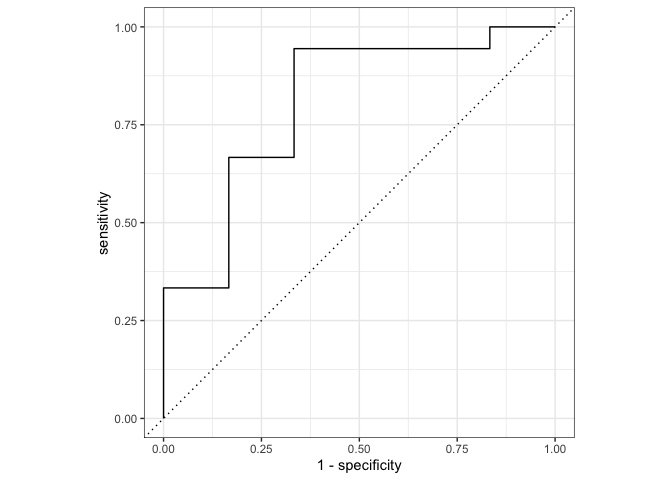
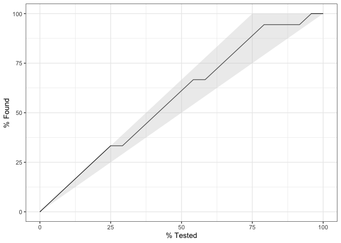

Load packages
-------------

``` r
pacman::p_load(pacman, tidyverse, tidymodels, groupdata2)
```

For more on the data see [Lacourse et at.
(2001)](https://www.researchgate.net/publication/226157359_Heavy_Metal_Music_and_Adolescent_Suicidal_Risk)

Load Data and Data Preperation
------------------------------

``` r
heavy_data <- read_csv("datasets/Lacourse et al. (2001) Females.csv", col_types = cols()) %>% 
  mutate_at(c("Age_Group", "Marital_Status", "Gender", "Suicide_Risk"), as.factor)

#examine dataset
heavy_data %>% head(5) %>% knitr::kable()
```

|    Age| Age\_Group      |  Drug\_Use|  Father\_Negligence| Gender |  Isolation| Marital\_Status       |  Meaninglessness|     Metal|  Mother\_Negligence|  Normlessness|  Self\_Estrangement| Suicide\_Risk |  Vicarious|  Worshipping|
|------:|:----------------|----------:|-------------------:|:-------|----------:|:----------------------|----------------:|---------:|-------------------:|-------------:|-------------------:|:--------------|----------:|------------:|
|  15.83| 14-16 Years Old |          8|                  17| Female |          6| Together              |               10|  4.837625|                  10|             6|                  15| Non-Suicidal  |          5|            4|
|  14.92| 14-16 Years Old |          9|                  23| Female |          8| Together              |               26|  6.000000|                  12|             8|                  20| Non-Suicidal  |          4|            6|
|  15.33| 14-16 Years Old |          5|                  15| Female |         18| Together              |               19|  6.000000|                  16|             7|                  17| Non-Suicidal  |          6|            3|
|  15.83| 14-16 Years Old |         11|                  11| Female |          9| Separated or Divorced |               13|  4.000000|                  10|             5|                  12| Non-Suicidal  |          3|            3|
|  14.92| 14-16 Years Old |          7|                  13| Female |          5| Together              |               13|  8.000000|                  16|             3|                   6| Non-Suicidal  |          3|            9|

``` r
# Prep the dataset
df <- heavy_data %>%
  select(-Age_Group, -Gender) #since it is highly correlated with Age and Gender = Female
```

Partioning the data
-------------------

Using groupdata2, note that you can also use rsample which follows the
tidymodels framework, but does not (at least easily) allow for
categorical and ID columns.

``` r
set.seed(5)
df_list <- partition(df, p = 0.2, cat_col = c("Suicide_Risk"), id_col = NULL, list_out = T)
df_test = df_list[[1]]
df_train = df_list[[2]]
```

If you have an id column you should remove it after here. Otherwise it
will be included as a predictor.

Let’s define a ‘recipe’ that preprocesses the data
--------------------------------------------------

Note that the naming in recipe (a package within tidymodels), can be
rather odd. They really dig the recipe metaphor.

``` r
#create recipe
rec <- df_train %>% recipe(Suicide_Risk ~ .) %>% # defines the outcome
  step_center(all_numeric()) %>% # center numeric predictors
  step_scale(all_numeric()) %>% # scales numeric predictors
  step_corr(all_numeric()) %>% 
  check_missing(everything()) %>%
  prep(training = df_train)

train_baked <- juice(rec) # extract df_train from rec

rec #inspect rec
```

    ## Data Recipe
    ## 
    ## Inputs:
    ## 
    ##       role #variables
    ##    outcome          1
    ##  predictor         12
    ## 
    ## Training data contained 97 data points and no missing data.
    ## 
    ## Operations:
    ## 
    ## Centering for Age, Drug_Use, ... [trained]
    ## Scaling for Age, Drug_Use, ... [trained]
    ## Correlation filter removed no terms [trained]
    ## Check missing values for Age, Drug_Use, ... [trained]

This is naturally just an example of how a reciple could be done. It
does not need to check for e.g. missing values or correlation if I know
it is not an issue.

### Apply recipe to test

``` r
test_baked <- rec %>% bake(df_test)
```

**note** that we just extract the `df_train` from the recipe (`rec`) to
convince yourself that they are indeed the same compare `juice(rec)`
with `rec %>% bake(df_train)`.

Creating models
---------------

To see all the available models in parsnip (part of tidy models) go
[here](https://tidymodels.github.io/parsnip/articles/articles/Models.html).

``` r
#logistic regression
log_fit <- 
  logistic_reg() %>%
  set_mode("classification") %>% 
  set_engine("glm") %>%
  fit(Suicide_Risk ~ . , data = train_baked)

#support vector machine
svm_fit <-
  svm_rbf() %>%
  set_mode("classification") %>% 
  set_engine("kernlab") %>%
  fit(Suicide_Risk ~ . , data = train_baked)
```

Apply model to test set
-----------------------

``` r
#predict class
log_class <- log_fit %>%
  predict(new_data = test_baked)
#get prob of class
log_prop <- log_fit %>%
  predict(new_data = test_baked, type = "prob") %>%
  pull(.pred_Suicidal)

#get multiple at once
test_results <- 
  test_baked %>% 
  select(Suicide_Risk) %>% 
  mutate(
    log_class = predict(log_fit, new_data = test_baked) %>% 
      pull(.pred_class),
    log_prob  = predict(log_fit, new_data = test_baked, type = "prob") %>% 
      pull(.pred_Suicidal),
    svm_class = predict(svm_fit, new_data = test_baked) %>% 
      pull(.pred_class),
    svm_prob  = predict(svm_fit, new_data = test_baked, type = "prob") %>% 
      pull(.pred_Suicidal)
  )

test_results %>% 
  head(5) %>% 
  knitr::kable() #examine the first 5
```

| Suicide\_Risk | log\_class   |  log\_prob| svm\_class   |  svm\_prob|
|:--------------|:-------------|----------:|:-------------|----------:|
| Non-Suicidal  | Non-Suicidal |  0.0038562| Non-Suicidal |  0.0354329|
| Non-Suicidal  | Non-Suicidal |  0.2125898| Non-Suicidal |  0.5161208|
| Non-Suicidal  | Non-Suicidal |  0.3828569| Non-Suicidal |  0.3209701|
| Non-Suicidal  | Non-Suicidal |  0.0860703| Non-Suicidal |  0.0462909|
| Non-Suicidal  | Non-Suicidal |  0.0729597| Non-Suicidal |  0.3043180|

Performance metrics
-------------------

``` r
metrics(test_results, truth = Suicide_Risk, estimate = log_class) %>% 
  knitr::kable()
```

| .metric  | .estimator |  .estimate|
|:---------|:-----------|----------:|
| accuracy | binary     |  0.8750000|
| kap      | binary     |  0.6470588|

``` r
metrics(test_results, truth = Suicide_Risk, estimate = svm_class) %>% 
  knitr::kable()
```

| .metric  | .estimator |  .estimate|
|:---------|:-----------|----------:|
| accuracy | binary     |  0.8333333|
| kap      | binary     |  0.5000000|

``` r
#plotting the roc curve:
test_results %>%
  roc_curve(truth = Suicide_Risk, log_prob) %>% 
  autoplot()
```



``` r
test_results %>% 
  mutate(log_prob = 1 - log_prob) %>% # for the plot to show correctly (otherwise the line would be flipped)
  gain_curve(truth = Suicide_Risk, log_prob) %>% 
  autoplot()
```



For more on how to interpret roc curves see this [toward datascience
blogpost](https://towardsdatascience.com/understanding-auc-roc-curve-68b2303cc9c5)

For more on how to interpret gain curves see this [stack exchange
question](https://stats.stackexchange.com/questions/279385/gain-curve-interpretation)

Multiple Cross Validation
-------------------------

``` r
# create 10 folds, 10 times, and make sure Suicide_Risk is balances across groups
cv_folds <- vfold_cv(df_train, v = 10, repeats = 10, strata = Suicide_Risk)
```

**Note** that to respect ID use `group_vfold_cv()` or specify `group`.

That was almost too easy. Now let us prepare the dataset and the fit the
model to each supset.

``` r
#prepare data set and fetch train data
cv_folds <- cv_folds %>% 
  mutate(recipes = splits %>%
           # prepper is a wrapper for `prep()` which handles `split` objects
           map(prepper, recipe = rec),
         train_data = splits %>% map(training))

# train model of each fold
  # create a non-fitted model
log_fit <- 
  logistic_reg() %>%
  set_mode("classification") %>% 
  set_engine("glm") 


cv_folds <- cv_folds %>%  mutate(
  log_fits = pmap(list(recipes, train_data), #input 
                            ~ fit(log_fit, formula(.x), data = bake(object = .x, new_data = .y)) # function to apply
                 ))
```

map2 is a parallel version of map. It have the syntax:
`pmap(list(x, y), ~ .x + .y)`, where x and y are input and ´\~.x + .y´
if the function to apply. You could also have used `map2`, which is
specialised for just two variables `map2(x, y, ~ .x + .y)`.

``` r
cv_folds %>% head(5)
```

    ## # A tibble: 5 x 6
    ##   splits          id       id2    recipes     train_data        log_fits   
    ## * <named list>    <chr>    <chr>  <named lis> <named list>      <named lis>
    ## 1 <split [86/11]> Repeat01 Fold01 <recipe>    <tibble [86 × 13… <fit[+]>   
    ## 2 <split [86/11]> Repeat01 Fold02 <recipe>    <tibble [86 × 13… <fit[+]>   
    ## 3 <split [86/11]> Repeat01 Fold03 <recipe>    <tibble [86 × 13… <fit[+]>   
    ## 4 <split [87/10]> Repeat01 Fold04 <recipe>    <tibble [87 × 13… <fit[+]>   
    ## 5 <split [88/9]>  Repeat01 Fold05 <recipe>    <tibble [88 × 13… <fit[+]>

Note how the dataframe looks. Take some time to understand it and note
especially that cells contains entire datasets and their respective
recipes and models.

Now it gets slightly more complicated, we create a function which takens
in a split (fold) from the above cross validation and applies a recipe
and a model to it. Returns a tibble containing the actual and predicted
results. We then apply it to the dataset.

``` r
predict_log <- function(split, rec, model) {
  # IN
    # split: a split data
    # rec: recipe to prepare the data
    # 
  # OUT
    # a tibble of the actual and predicted results
  baked_test <- bake(rec, testing(split))
  tibble(
    actual = baked_test$Suicide_Risk,
    predicted = predict(model, new_data = baked_test) %>% pull(.pred_class),
    prop_sui =  predict(model, new_data = baked_test, type = "prob") %>% pull(.pred_Suicidal),
    prop_non_sui =  predict(model, new_data = baked_test, type = "prob") %>% pull(`.pred_Non-Suicidal`)
  ) 
}

# apply our function to each split, which their respective recipes and models (in this case log fits) and save it to a new col
cv_folds <- cv_folds %>% 
  mutate(pred = pmap(list(splits, recipes, log_fits) , predict_log))
```

Performance metrics
-------------------

``` r
eval <- 
  cv_folds %>% 
  mutate(
    metrics = pmap(list(pred), ~ metrics(., truth = actual, estimate = predicted, prop_sui))) %>% 
  select(id, id2, metrics) %>% 
  unnest(metrics)

#inspect performance metrics
eval %>% 
  select(repeat_n = id, fold_n = id2, metric = .metric, estimate = .estimate) %>% 
  spread(metric, estimate) %>% 
  head() %>% 
  knitr::kable()
```

| repeat\_n | fold\_n |   accuracy|         kap|  mn\_log\_loss|   roc\_auc|
|:----------|:--------|----------:|-----------:|--------------:|----------:|
| Repeat01  | Fold01  |  0.6363636|   0.0833333|       1.282365|  0.4583333|
| Repeat01  | Fold02  |  0.6363636|  -0.1578947|       2.155142|  0.7916667|
| Repeat01  | Fold03  |  0.7272727|   0.2325581|       3.027221|  0.7083333|
| Repeat01  | Fold04  |  0.8000000|   0.5238095|       2.302621|  0.9523810|
| Repeat01  | Fold05  |  0.8888889|   0.6086957|       2.145611|  0.5000000|
| Repeat01  | Fold06  |  0.7777778|   0.3571429|       1.693287|  0.7857143|

FAQ
---

### We have problems with merge and ID’s what should we do?

You should first of all have that the following code evaluates to true,
e.g. there should be the same amount of datapoint as you have pitch
files.

    nrow(df) == length(list.files(path = filepath, pattern = ".txt", full.names = T))

Furthermore you should have unique participant ID’s. You can check this
using the following code. Before you use it write a comment about what
it does and why it works. What should the maximum value of
`n_studies_pr_id` be?

    df %>% select(id, study) %>% unique() %>%  group_by(id) %>% summarise(n_studies_pr_id = n()) %>% View()

### Can I please have some more CVMS?

Of course you can! Note that you will need to update cvms from CRAN,
before the following work. The following is an example sent to me by
Ludvig.

``` r
# Attach packages
pacman::p_load(cvms, tidymodels) 

# Prepare data
dat <- groupdata2::fold(participant.scores, k = 4,
                                     cat_col = 'diagnosis',
                                     id_col = 'participant')
dat[["diagnosis"]] <- factor(dat[["diagnosis"]])

# Create a model function (random forest in this case)
# that takes train_data and formula as arguments
# and returns the fitted model object
rf_model_fn <- function(train_data, formula){
    rand_forest(trees = 100, mode = "classification") %>%
      set_engine("randomForest") %>%
      fit(formula, data = train_data)
  }

# Create a predict function
# Usually just wraps stats::predict
# Takes test_data, model and formula arguments
# and returns vector with probabilities of class 1
# (this depends on the type of task, gaussian, binomial or multinomial)
rf_predict_fn <- function(test_data, model, formula){
    stats::predict(object = model, new_data = test_data, type = "prob")[[2]]
  }

# Now cross-validation
# Note the different argument names from cross_validate()
CV <- cross_validate_fn(
  dat,
  model_fn = rf_model_fn,
  formulas = c("diagnosis~score", "diagnosis~age"),
  fold_cols = '.folds',
  type = 'binomial',
  predict_fn = rf_predict_fn
)
<<<<<<< HEAD
CV %>% head(1) %>% knitr::kable()
```

|     Balanced Accuracy|            F1|     Sensitivity|     Specificity|     Pos Pred Value|     Neg Pred Value|           AUC|      Lower CI|     Upper CI|         Kappa|           MCC|     Detection Rate|     Detection Prevalence|     Prevalence| Predictions                                                                                                                                                                                                                                                                                                                                                                                                                                                                                                                                                                                                                                                                                                        | ROC | Confusion Matrix | Coefficients |  Folds|  Fold Columns|  Convergence Warnings|  Other Warnings| Warnings and Messages | Family | Dependent | Fixed |
|---------------------:|-------------:|---------------:|---------------:|------------------:|------------------:|-------------:|-------------:|------------:|-------------:|-------------:|------------------:|------------------------:|--------------:|:-------------------------------------------------------------------------------------------------------------------------------------------------------------------------------------------------------------------------------------------------------------------------------------------------------------------------------------------------------------------------------------------------------------------------------------------------------------------------------------------------------------------------------------------------------------------------------------------------------------------------------------------------------------------------------------------------------------------|:----|:-----------------|:-------------|------:|-------------:|---------------------:|---------------:|:----------------------|:-------|:----------|:------|
|             0.5972222|     0.7179487|       0.7777778|       0.4166667|          0.6666667|          0.5555556|     0.7060185|     0.5186112|    0.8934258|     0.2028986|     0.2078699|          0.4666667|                      0.7|            0.6| list(`Fold Column` = c(“.folds”, “.folds”, “.folds”, “.folds”, “.folds”, “.folds”, “.folds”, “.folds”, “.folds”, “.folds”, “.folds”, “.folds”, “.folds”, “.folds”, “.folds”, “.folds”, “.folds”, “.folds”, “.folds”, “.folds”, “.folds”, “.folds”, “.folds”, “.folds”, “.folds”, “.folds”, “.folds”, “.folds”, “.folds”, “.folds”), Fold = c(1, 1, 1, 1, 1, 1, 2, 2, 2, 2, 2, 2, 2, 2, 2, 3, 3, 3, 3, 3, 3, 4, 4, 4, 4, 4, 4, 4, 4, 4), Target = c(1, 1, 1, 2, 2, 2, 1, 1, 1, 2, 2, 2, 2, 2, 2, 1, 1, 1, 2, 2, 2, 1,                                                                                                                                                                                               |     |                  |              |       |              |                      |                |                       |        |           |       |
|  1, 1, 2, 2, 2, 2, 2,|   2), Predict|   ion = c(0.81,|  0.28, 0, 0.51,|   0.15, 0, 0.88, 0|   .92, 0.26, 0.99,|   0.88, 0.92,|   0.99, 0.09,|  0.92, 0.53,|   0.59, 0.26,|  1, 0.87, 0.9|  2, 0.67, 0.69, 0.|  01, 0.98, 0.68, 0.41, 0|  .98, 0.6, 0.6| 8), `Predicted Class` = c(“1”, “0”, “0”, “1”, “0”, “0”, “1”, “1”, “0”, “1”, “1”, “1”, “1”, “0”, “1”, “1”, “1”, “0”, “1”, “1”, “1”, “1”, “1”, “0”, “1”, “1”, “0”, “1”, “1”, “1”)) list(Sensitivities = c(1, 0.944444444444444, 0.944444444444444, 0.888888888888889, 0.833333333333333, 0.833333333333333, 0.833333333333333, 0.777777777777778, 0.722222222222222, 0.722222222222222, 0.722222222222222, 0.666666666666667, 0.666666666666667, 0.555555555555556, 0.555555555555556, 0.555555555555556, 0.5, 0.444444444444444, 0.277777777777778, 0.166666666666667, 0.0555555555555556, 0), Specificities = c(0, 0.0833333333333333, 0.166666666666667, 0.166666666666667, 0.166666666666667, 0.333333333333333, |     |                  |              |       |              |                      |                |                       |        |           |       |
|  0.416666666666667, 0|  .41666666666|  6667, 0.416666|  666666667, 0.5|  , 0.5833333333333|  33, 0.58333333333|  3333, 0.6666|  66666666667,|  0.666666666|  666667, 0.75|  , 0.83333333|  3333333, 0.833333|  333333333, 0.9166666666|   66667, 1, 1,| 1, 1)) list(`Fold Column` = c(“.folds”, “.folds”, “.folds”, “.folds”), Prediction = c(“0”, “1”, “0”, “1”), Target = c(“0”, “0”, “1”, “1”), Pos\_0 = c(“TP”, “FN”, “FP”, “TN”), Pos\_1 = c(“TN”, “FP”, “FN”, “TP”), N = c(5, 7, 4, 14)) list(term = NA, estimate = NA, std.error = NA, statistic = NA, Fold = NA, `Fold Column` = NA, p.value = NA) 4 1 0 0 list(`Fold Column` = character(0), Fold = integer(0), Function = character(0), Type = character(0), Message = character(0)) binomial diagnosis score                                                                                                                                                                                                    |     |                  |              |       |              |                      |                |                       |        |           |       |

=======
<<<<<<< HEAD
CV %>% head(2)
```

    ## # A tibble: 2 x 26
    ##   `Balanced Accur…    F1 Sensitivity Specificity `Pos Pred Value`
    ##              <dbl> <dbl>       <dbl>       <dbl>            <dbl>
    ## 1            0.597 0.718       0.778       0.417            0.667
    ## 2            0.292 0.364       0.333       0.25             0.40 
    ## # … with 21 more variables: `Neg Pred Value` <dbl>, AUC <dbl>, `Lower
    ## #   CI` <dbl>, `Upper CI` <dbl>, Kappa <dbl>, MCC <dbl>, `Detection
    ## #   Rate` <dbl>, `Detection Prevalence` <dbl>, Prevalence <dbl>,
    ## #   Predictions <list>, ROC <list>, `Confusion Matrix` <list>,
    ## #   Coefficients <list>, Folds <int>, `Fold Columns` <int>, `Convergence
    ## #   Warnings` <int>, `Other Warnings` <int>, `Warnings and
    ## #   Messages` <list>, Family <chr>, Dependent <chr>, Fixed <chr>

=======
CV %>% knitr::kable(format = "latex", booktabs = TRUE, linesep = "") #due to odd print of table
```

>>>>>>> 0dfa01d63303b9ef45626d5c7644747ff538f747
>>>>>>> 2b7226f47f79d385b0c88b9acc72ef6d6a7a7aee
### I want to do more!

Well you crazy bastard! I encourage you to do one of these two things
(or both): 1) do a bootstrapped and nested cross validation 2) make a
ensample model, which combines it input of multiple models. Does
combining models yield better results? What a potential issues with this
approach?
